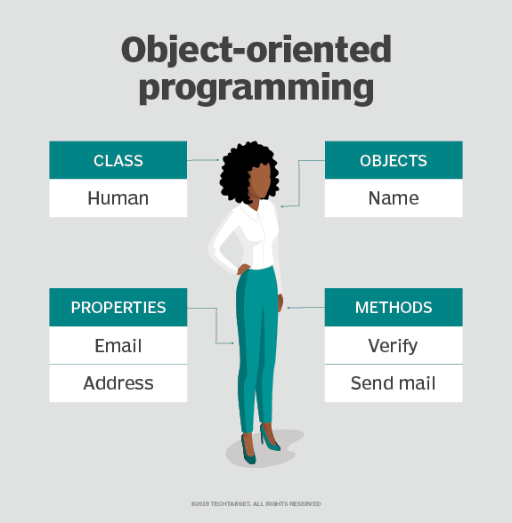

# :star::snake: Python: What is it and how do I get it? :star::snake: #


### Some history ###

Python was conceived in the late 1980s by [Guido van Rossum](https://en.wikipedia.org/wiki/Guido_van_Rossum) at Centrum Wiskunde & Informatica (CWI) in the Netherlands and its implementation began in December 1989.

Its popularity in recent years has [skyrocketed](https://stackoverflow.blog/2017/09/06/incredible-growth-python/), due to its ease of use, growing number of libraries and readability. Disclaimer: Python is not the only language out there, in fact there are hundreds, if not thousands, each designed, and optimized, with a particular utility in mind; Pythons is readability and flexibility. Python is one of the easiest languages to pick up and use, but it may not be the best language for the task that you wish to conduct - it is important to keep this in the back of your mind.

Python belongs to a family of languages called *Object orientated languages*, that is languages organised around objects, rather than "actions" and data rather than logic.

The following image is useful for understanding what an OOP is:



[Source](https://searchapparchitecture.techtarget.com/definition/object-oriented-programming-OOP) 

You can see from the image that the language uses *objects* to *encapsulate* properties of the *object* you care about. In this case, the *class* of the *object* is human. Each human object has a name and when a human is initiated, it has a number of fixed *properties*, or *attributes*, in this case an Email and home address. Each human can do many things, or *methods*, in this case they can verify messages and then send the message via Email, and, or a home address.

We can also *inherit* or create base objects for other objects to inherit from. You can think of inheritance with the following analogy. You have a Parent, who has a Child. The Child inherits genetic traits from the Parent and any further Child, of the Child of the Parent, will inherit from Parent and the Child. In this case, you don't have to redefine certain attributes, or methods. Instead they are inherited from one object to the next. There may come a time when evolution strikes and a child develops a new method, or attribute. Well that is easy to handle, we just add those things to the class that inherited from its predecessors. We will see examples of this in later weeks. 


## Installing Python (3+ and 2.7+) ##

To make our lives easier, we are going to install Python using package management software, which will simplify your lives drastically. In particular we are going to leverage something called [Anaconda](https://www.anaconda.com/). 

### Installing miniconda, a light weight version of Anaconda. ###

First [click here](https://docs.conda.io/en/latest/miniconda.html) to go to the download page for miniconda, you will see the following page:


Download the `Python 3.<a_number>` `64-bit` Mac, or Linux, or Windows file. It depends on which operating system (OS) your machine is using.

### Installing Miniconda on Mac/ Linux ##

Linux users can put their feet up for a few seconds, as we need an additional package manager for MAC OS based systems, called `Brew`, 
this will make our lives much easier, if you use a Mac. 

### Additional step ###
Open up the terminal (on MAC press `cmd` + `space` and then type `terminal` and hit `enter`.)

Within the terminal window type:
```ruby
/usr/bin/ruby -e "$(curl -fsSL https://raw.githubusercontent.com/Homebrew/install/master/install)"
```
and then hit `enter`.

see image below:


Brew will then proceed to install. We will use this later on. 


### Installing Miniconda ###

Still inside the terminal go to the downloaded location of the miniconda file. 

First locate where the file has been downloaded and in the terminal type:

```shell 
cd <location of file>
```
Then type
```shell
bash Miniconda<press tab key>
```

Follows the prompts (agree to the T&Cs) and state that you want conda to add something to your `.bashrc` file. 

Close the terminal and reopen the terminal. 

### Installing Miniconda on Windows ##

#### Additional step ####

For Windows machines, to make my teaching life easier, please install the Git for windows, [click here](https://gitforwindows.org/). 

Click the download button, on the webpage:


Open a 
